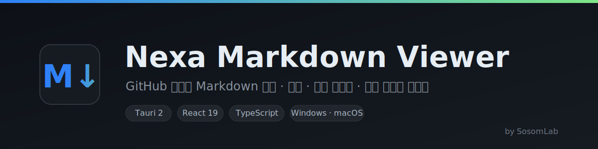
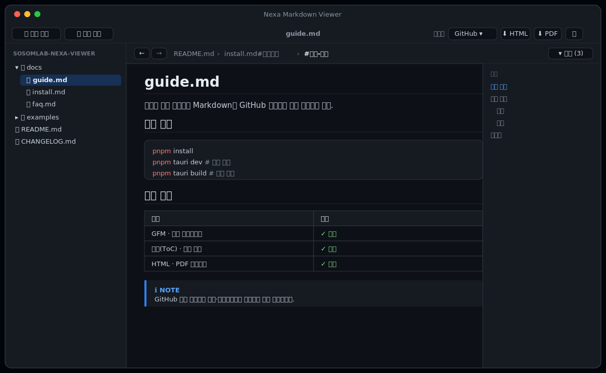

<p align="center">
  
</p>

<p align="center">
  
  
  
  
  
</p>

# Nexa Markdown Viewer

**로컬과 원격 저장소의 Markdown을 GitHub 스타일로 읽는 크로스 플랫폼 데스크톱 뷰어.**
빠르고 가벼운 [Tauri](https://tauri.app) 기반(네이티브 웹뷰, 작은 용량)이며, 소스(로컬/GitHub/…)와
렌더링 방식을 **추상화**해 손쉽게 확장할 수 있도록 설계되었습니다. 제작: **SosomLab**.

<p align="center">
  
</p>

> 위 이미지는 UI 미리보기(목업)입니다. 실제 스크린샷으로 교체 가능합니다.

---

## ✨ 주요 특징

- **GitHub 스타일 렌더링** — GFM(표·체크박스·취소선·자동링크), `github-markdown-css` 라이트/다크 테마
- **언어별 코드 구문 강조** — highlight.js, 테마와 자동 동기화
- **목차(ToC) 패널** — 문서 헤딩을 추출해 클릭 한 번으로 이동
- **문서 이동 기록(파일#앵커)** — ←/→ 이동, 상단 브레드크럼(최대 3개), 파일별 그룹 기록에서 **1-클릭 점프**
  - 같은 파일 내 이동은 `#앵커`, 다른 파일은 `파일명#앵커`로 기록
- **위키 스타일 문서 간 링크** — 상대 `.md` 링크/이미지 자동 해석, 외부 링크는 기본 브라우저로
- **내보내기** — HTML(스타일 인라인) · PDF(인쇄)
- **최근 문서 / 테마 / 렌더링 설정 기억** — 재실행해도 유지
- **교체 가능한 렌더 프로파일** — 렌더링 방식을 선택 전환(추후 수식·다이어그램 프로파일 추가 가능)
- **확장 가능한 소스 추상화** — 로컬 외에 GitHub/Bitbucket 등을 동일 인터페이스로 추가

---

## 🚀 빠른 시작

> 사전 요구: [Node.js](https://nodejs.org) + [pnpm](https://pnpm.io), [Rust](https://rustup.rs)(rustup),
> 그리고 [Tauri 사전 준비물](https://tauri.app/start/prerequisites/).

```bash
pnpm install
pnpm tauri dev      # 개발 실행 (창 표시)
```

새 터미널에서 `cargo`가 안 잡히면: `source "$HOME/.cargo/env"`

---

## 📦 빌드 & 배포

```bash
pnpm tauri build    # 배포용 설치 파일 생성
```

산출물은 `src-tauri/target/release/bundle/` 에 생성됩니다.

| OS | 산출물 |
|----|--------|
| **macOS** | `.dmg`, `.app` (유니버설: `--target universal-apple-darwin`) |
| **Windows** | `.msi`(WiX), `*-setup.exe`(NSIS) |

> Windows/macOS는 각 OS에서 빌드해야 합니다. `v*` 태그 push로 **GitHub Actions → Releases**
> 자동 배포됩니다(`tauri-apps/tauri-action`). 산출물 예: `NexaMarkdownViewer_0.1.0_universal.dmg`,
> `NexaMarkdownViewer_0.1.0_x64-setup.exe`.

---

## ⬇️ 다운로드 & 설치

[**Releases**](https://github.com/kiros33/sosomlab-nexa-viewer/releases) 에서 OS에 맞는 파일을 받으세요.

| OS | 파일 | 설치 |
|----|------|------|
| **macOS** | `…_universal.dmg` | 열어서 앱을 Applications로 드래그 |
| **Windows** | `…_x64-setup.exe` | 실행 후 마법사 진행 |

> ⚠️ **현재 코드 서명(code signing)이 적용되어 있지 않습니다.** 따라서 첫 실행 시
> 운영체제의 보안 경고가 표시될 수 있습니다. (신뢰할 수 있는 출처에서 받은 경우에만 진행하세요.)
>
> - **macOS** — "확인되지 않은 개발자" 경고 시: 앱을 **우클릭 → 열기**(한 번만), 또는 터미널에서
>   `xattr -dr com.apple.quarantine "/Applications/NexaMarkdownViewer.app"`
> - **Windows** — SmartScreen 경고 시: **추가 정보 → 실행**
>
> 정식 배포 단계에서는 Apple Developer 인증서(notarization)·Windows 코드 서명 인증서를 적용할 예정입니다(로드맵).

---

## 🧱 기술 스택 & 구조

- **프론트엔드**: React 19 · TypeScript · Vite · zustand · react-markdown(remark/rehype)
- **백엔드**: Rust · Tauri 2 (dialog/fs/opener 플러그인)

```
src/
  sources/    # 소스 추상화 (ContentSource: local / github / …)
  renderer/   # 렌더 프로파일 + MarkdownView (교체 가능한 렌더링)
  store/      # zustand 상태 (문서/테마/이동 기록)
  components/ # FileTree · Toc · Toolbar · HistoryBar
src-tauri/
  src/providers/  # Rust ContentProvider 트레잇 + LocalProvider
  src/commands.rs # 파일/디렉터리/에셋 읽기 · 저장 커맨드
```

---

## 📝 변경 이력 / 릴리스 노트

최근 변경 요약(자세한 내용은 아래 링크):
- **GitHub 원격 저장소** 연동 — PAT 로그인(공개 repo는 로그인 불필요), 계정 저장소 목록에서
  선택 추가, 트리 탐색·열람, **온라인 갱신 감지 + 새로고침**
- 패널 **크기 조절** + VSCode/Eclipse 스타일 **토글**, **이동 기록(파일#앵커)**
- 앱 아이콘/About 화면, **Windows·macOS·Linux** 자동 빌드/배포

> 📓 상세 변경 이력: **[CHANGELOG.md](CHANGELOG.md)** · 다운로드/노트: **[GitHub Releases](https://github.com/kiros33/sosomlab-nexa-viewer/releases)**

## 🗺 로드맵

데스크톱(Windows/macOS) 우선, 이후 Linux·모바일. 단계별 계획과 요구사항 추적은
**[docs/ROADMAP.md](docs/ROADMAP.md)** 참고.

- **M1 ✅** 로컬 뷰어 · 파일트리 · ToC · 이동 기록 · 내보내기 · 테마
- **M2** 수식(KaTeX) · Mermaid 다이어그램 · GitHub Alerts
- **M3** GitHub 원격 소스 · 토큰 암호화 저장 · 다중 저장소
- **M4** Bitbucket/GitLab provider
- **M5** 검색 · 탭 · 백링크/링크 그래프 · 태그
- **M6** Git diff 비교 · **M7** 모바일(iOS/Android)

작업 일지: **[docs/PROGRESS.md](docs/PROGRESS.md)**

---

<p align="center"><sub>© 2026 SosomLab · Built with Tauri + React</sub></p>
