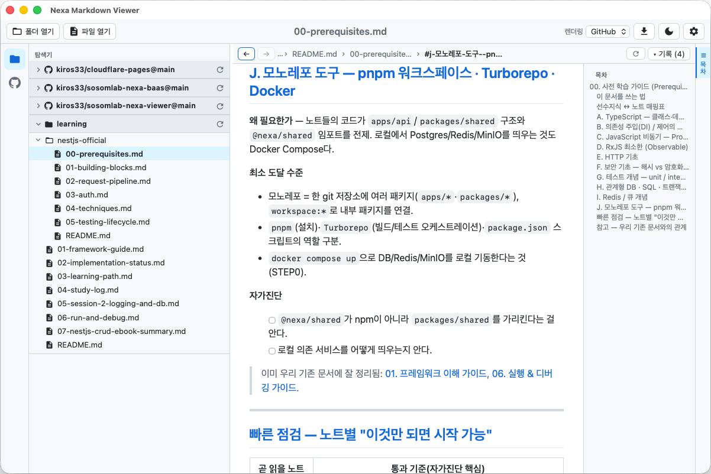
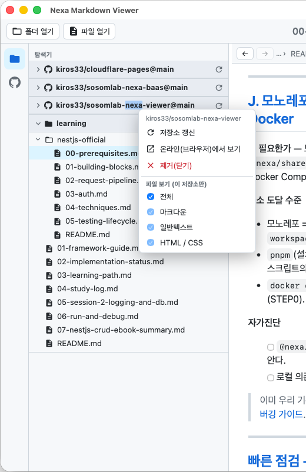

# 탐색기 (Explorer)

좌측 **액티비티 바**의 폴더 아이콘으로 탐색기를 엽니다. 등록한 **여러 폴더/저장소가 접이식 루트**로
나열되며, 각 루트는 배경색으로 구분됩니다.

## 좌측 폴딩 (탐색기 / GitHub)
- 액티비티 바의 **폴더 아이콘** = 탐색기, **GitHub(옥토캣) 아이콘** = GitHub 패널.
- 활성 아이콘을 **다시 클릭하면 좌측 패널이 접힙니다**(본문을 더 넓게). 다시 클릭하면 펼침.

## 루트(저장소/폴더)
- 기본 **접힘** 상태(최초 등록/실행 시). **▸/▾** 로 펼치면 하위 트리를 지연 로드합니다.
- 펼침 상태는 저장되어 **탭 전환/재실행 후에도 유지**됩니다.
- 루트 우측 **🔄 갱신** 버튼: 해당 저장소 트리만 새로고침.
- 폴더(📁/📂)와 파일(📄 마크다운 / 📃 일반) 아이콘으로 구분.
- **폴더 클릭** = 펼침/접힘만(우측 문서 유지), **파일 클릭** = 본문 열기.

## 우클릭 컨텍스트 메뉴
저장소명/폴더/파일에서 **우클릭** 하면 저장소별 옵션이 나옵니다.

- **저장소 갱신** — 트리 새로고침
- **온라인(브라우저)에서 보기 / 폴더 열기** — GitHub는 저장소 페이지, 로컬은 파일 관리자
- **제거(닫기)** — 탐색기에서 해당 루트 제거
- **파일 보기** — 이 저장소만의 표시 필터(전체 / 마크다운 / 일반텍스트 / HTML·CSS)

## 표시 파일 필터
- 기본은 **마크다운만** 표시(폴더는 항상 표시).
- 전역 변경: 툴바 **⚙️ 환경설정 → 보여질 파일**(모든 저장소 일괄 적용) → [환경설정](Preferences)
- 저장소별 변경: **우클릭 → 파일 보기**(해당 저장소만 override)

## 패널 크기 조절
탐색기/본문/ToC 사이 경계를 **드래그**하면 너비가 조절되고 저장됩니다.
