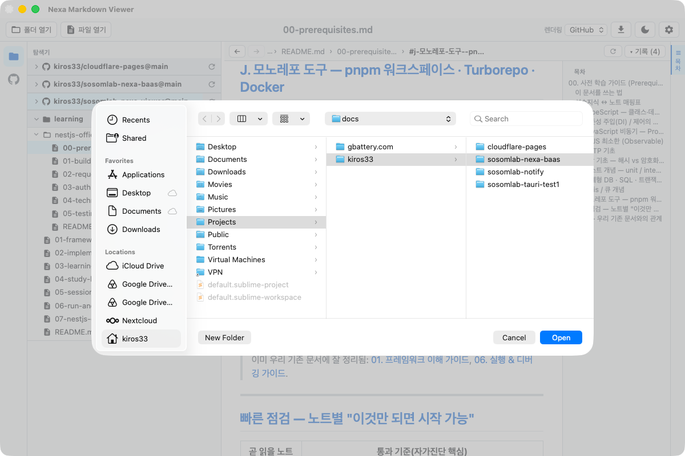
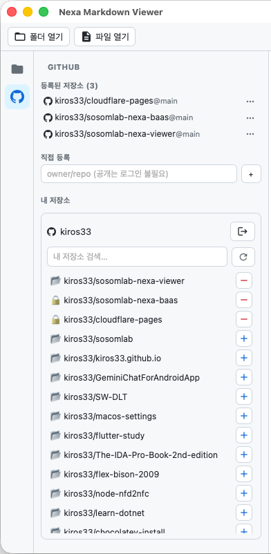
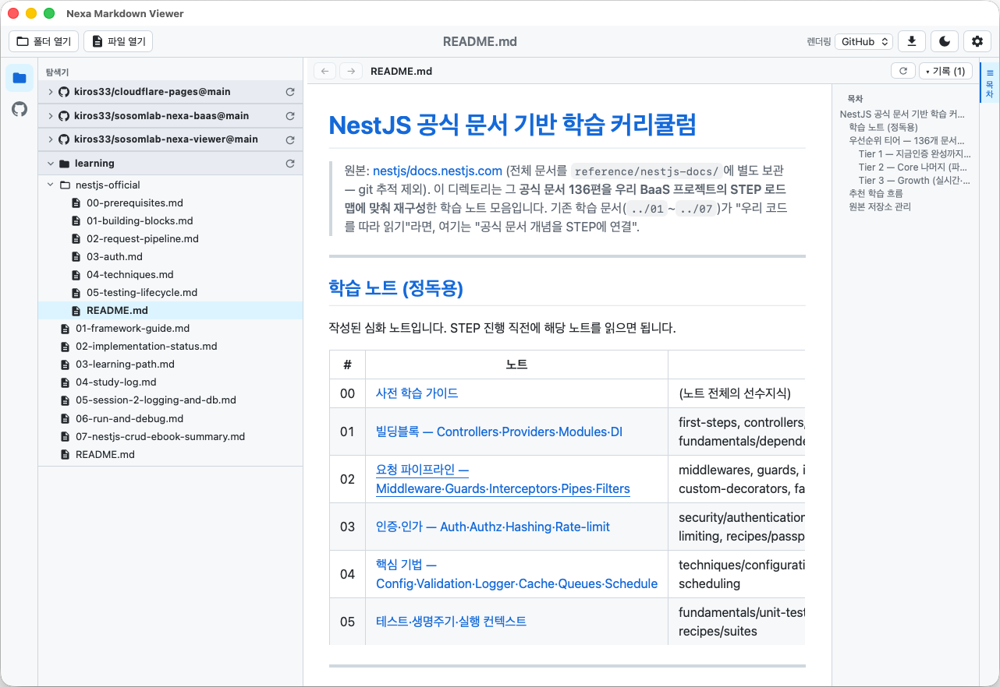

# 빠른 시작 (Getting Started)

앱을 열면 좌측 상단 버튼 또는 좌측 **액티비티 바**로 시작합니다.

## 1. 로컬 폴더/파일 열기
- 상단 **📁 폴더 열기** → 폴더 선택 → 탐색기에 **루트로 추가**(기본 접힘)
- 상단 **📄 파일 열기** → `.md` 선택 → 즉시 열람(부모 폴더도 탐색기에 등록)

## 2. GitHub 저장소 열기
- 좌측 액티비티 바의 **GitHub(옥토캣)** 아이콘 → GitHub 패널
- **공개 저장소**: `owner/repo` 입력 후 추가 (로그인 불필요)
- **비공개 저장소**: PAT 로그인 후 "내 저장소"에서 선택 → [GitHub 연동](GitHub-Integration)

## 3. 문서 읽기
탐색기에서 루트를 펼치고(▸) 파일을 클릭하면 우측에 GitHub 스타일로 렌더링됩니다.
우측 **목차(ToC)** 로 섹션 이동, 상단 **← / →** 로 이동 기록을 탐색합니다.

## 4. 자주 쓰는 동작
| 동작 | 방법 |
|------|------|
| 테마 전환(라이트/다크) | 툴바 🌙/☀️ |
| 내보내기 | 툴바 ⬇ → HTML/PDF 선택 |
| 환경설정 | 툴바 ⚙️ |
| 패널 너비 조절 | 경계 드래그 |
| 패널 숨김/표시 | 좌측 아이콘(탐색기/GitHub), 우측 바(목차) |
| 일반텍스트 글꼴 크기 | 비-마크다운 문서에서 `Ctrl/⌘ +`, `-`, `0`(리셋) |
