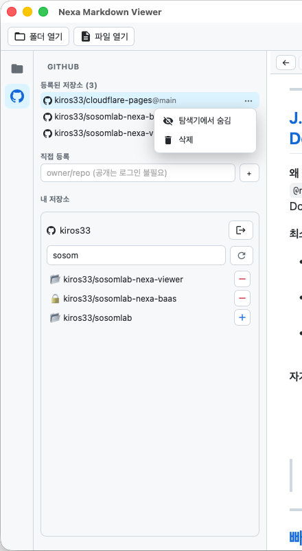
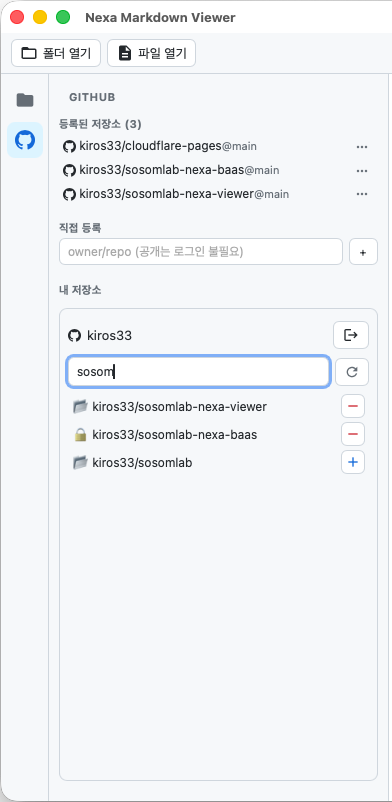

# GitHub 연동

좌측 액티비티 바의 **GitHub(옥토캣)** 아이콘으로 패널을 엽니다. 패널은 3구역입니다:
**① 등록된 저장소 · ② 직접 등록 · ③ 내 저장소**.

## ① 등록된 저장소 — 숨김 / 삭제
현재 탐색기에 추가된 GitHub 저장소 목록입니다. 각 항목의 **⋯** 메뉴에서 관리합니다.

- **탐색기에서 숨김** — 등록은 유지하되 탐색기에서만 숨김(다시 표시 가능)
- **삭제** — 등록 해제(탐색기에서 제거)

## ② 직접 등록
`owner/repo` 형식을 입력하고 **+** 를 누릅니다(GitHub URL 붙여넣기도 인식).
**공개 저장소는 로그인 없이** 바로 추가/열람됩니다.

## ③ 내 저장소 — 로그인/로그아웃, 조회·등록
### PAT 로그인 / 로그아웃
- **미로그인**: PAT 입력란 + **로그인** 아이콘 버튼
- **로그인됨**: 계정(예: `kiros33`) + **로그아웃** 아이콘 버튼

토큰은 **Rust 측에 AES-256-GCM으로 암호화 저장**되며 프론트엔드로 노출되지 않습니다. 통신은 HTTPS만 사용합니다.

**PAT 발급(권장: Fine-grained)**
1. GitHub → Settings → Developer settings → **Fine-grained tokens** → Generate
2. Repository access: 대상 저장소(또는 All)
3. Permissions → Repository → **Contents: Read-only**
4. `github_pat_…` 복사 → 앱 PAT 입력란에 붙여넣기 → 로그인

### 내 저장소 조회 및 등록/삭제
로그인하면 계정이 접근 가능한 저장소가 나열되고, **실시간 검색**이 됩니다.
미등록은 **+**(추가), 이미 등록된 항목은 **−**(등록 해제) 버튼이 표시됩니다.

> 목록은 창 높이에 맞춰 채워지고 내부 스크롤됩니다. 등록된 저장소가 많아도 잘리지 않고
> 모두 표시된 뒤 그 아래에 "내 저장소"가 옵니다.

## 온라인 갱신 감지
문서를 열 때 GitHub blob `sha`를 기억하고, **창에 다시 포커스**하면 최신 sha와 비교합니다.
변경되었으면 상단에 **🔄 갱신 가능** 배지가 뜨고, 클릭 시 최신 내용으로 다시 불러옵니다.

## 요청 한도
미인증(공개) 시간당 60회 · 인증(PAT) 시간당 5,000회.
