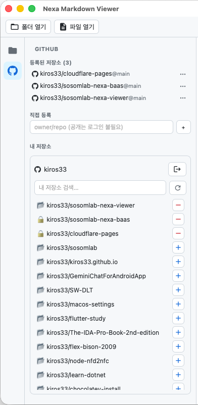
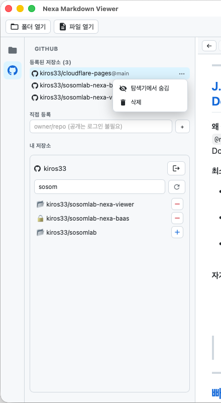
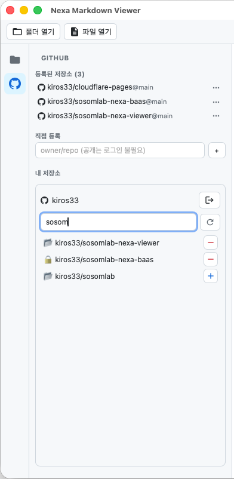

# GitHub 연동

좌측 액티비티 바의 **GitHub(옥토캣)** 아이콘으로 패널을 엽니다. 패널은 3구역입니다:
**① 등록된 저장소 · ② 직접 등록 · ③ 내 저장소**.



## ① 등록된 저장소 — 숨김 / 삭제
현재 탐색기에 추가된 GitHub 저장소 목록입니다. 각 항목의 **⋯** 메뉴에서 관리합니다.



- **탐색기에서 숨김** — 등록은 유지하되 탐색기에서만 숨김(다시 표시 가능)
- **삭제** — 등록 해제(탐색기에서 제거)

## ② 직접 등록
`owner/repo` 형식을 입력하고 **+** 를 누릅니다(GitHub URL 붙여넣기도 인식).
**공개 저장소는 로그인 없이** 바로 추가/열람됩니다.

## ③ 내 저장소 — 로그인/로그아웃, 조회·등록
### PAT 로그인 / 로그아웃
- **미로그인**: PAT 입력란 + **로그인** 아이콘 버튼
- **로그인됨**: 계정(예: `kiros33`) + **로그아웃** 아이콘 버튼

토큰은 **Rust 측에 AES-256-GCM으로 암호화 저장**되며 프론트엔드로 노출되지 않습니다. 통신은 HTTPS만 사용합니다.

### PAT 발급 — 어떤 토큰을 만들어야 하나요?

어디까지 보려는지에 따라 토큰 종류가 다릅니다. **조직(Organization) 저장소까지 보려면
방법 A(classic)를 권장**합니다.

| 보려는 범위 | 권장 토큰 |
|---|---|
| 개인 저장소만 | Fine-grained (Contents: Read-only) |
| 개인 + 조직 저장소 | **Classic (`repo` 스코프)** ← 권장 |
| 특정 조직 저장소만 | Fine-grained (Resource owner = 조직) |

#### 방법 A — Classic PAT (개인 + 조직, 권장)
1. GitHub → Settings → Developer settings → **Tokens (classic)** → Generate new token (classic)
2. 스코프에서 **`repo`** 체크(비공개 저장소 읽기에 필요) → 발급
3. 조직이 **SAML SSO**를 쓰는 경우(필수): 토큰 목록에서 해당 토큰의
   **Configure SSO → 조직 Authorize** 클릭 — 이 단계를 빼먹으면 조직 저장소가 계속 안 보입니다.
4. `ghp_…` 복사 → 앱 PAT 입력란에 붙여넣기 → 로그인

#### 방법 B — Fine-grained PAT
1. GitHub → Settings → Developer settings → **Fine-grained tokens** → Generate
2. **Resource owner** 선택 — 여기가 핵심입니다:
   - **본인 계정** 선택 시: 개인 저장소만 조회됩니다.
     **조직 저장소는 GitHub 정책상 아예 반환되지 않습니다**(비공개는 물론, 목록 API에서 제외).
   - **조직** 선택 시: 그 조직 저장소만 조회됩니다(조직 설정에서 fine-grained PAT
     허용 필요, 정책에 따라 관리자 승인 대기 가능).
3. Repository access: 대상 저장소(또는 All) · Permissions → Repository → **Contents: Read-only**
4. `github_pat_…` 복사 → 앱 PAT 입력란에 붙여넣기 → 로그인

> 앱은 토큰을 **1개만** 저장합니다. 개인+조직을 한 번에 보려면 방법 A를 쓰세요.
> 토큰을 바꿀 때는 **로그아웃 → 새 토큰으로 재로그인**해야 반영됩니다.

### 조직 저장소가 목록에 안 보일 때 (문제 해결 순서)
1. **토큰 종류 확인** — fine-grained(개인 Resource owner)라면 위 방법 A로 재발급.
2. **SSO 승인 확인** — SAML SSO 조직은 classic 토큰이라도 **Configure SSO 승인** 필수.
3. **멤버십 확인** — 조직의 멤버여야 합니다(Outside collaborator는 참여 저장소만 보임).
4. **토큰 자체 검증** — 터미널에서:
   ```bash
   curl -H "Authorization: Bearer <PAT>" https://api.github.com/user/orgs
   curl -H "Authorization: Bearer <PAT>" "https://api.github.com/orgs/<조직명>/repos?per_page=5"
   ```
   여기서 빈 배열이면 앱이 아니라 토큰/조직 정책 문제입니다.
5. **우회로** — 목록에 없어도 **② 직접 등록**에 `조직명/저장소명`을 입력하면 바로 열 수 있습니다.

> 참고: 목록 조회에는 상한이 있습니다(소속 목록 최대 300개 + 조직당 최대 200개, 최근
> 갱신순). 저장소가 매우 많은 조직에서 오래된 저장소가 안 보이면 검색 필터나 직접 등록을 쓰세요.

### 내 저장소 조회 및 등록/삭제
로그인하면 계정이 접근 가능한 저장소가 나열되고, **실시간 검색**이 됩니다.
미등록은 **+**(추가), 이미 등록된 항목은 **−**(등록 해제) 버튼이 표시됩니다.



> 목록은 창 높이에 맞춰 채워지고 내부 스크롤됩니다. 등록된 저장소가 많아도 잘리지 않고
> 모두 표시된 뒤 그 아래에 "내 저장소"가 옵니다.

## 온라인 갱신 감지
문서를 열 때 GitHub blob `sha`를 기억하고, **창에 다시 포커스**하면 최신 sha와 비교합니다.
변경되었으면 상단에 **🔄 갱신 가능** 배지가 뜨고, 클릭 시 최신 내용으로 다시 불러옵니다.

## 요청 한도
미인증(공개) 시간당 60회 · 인증(PAT) 시간당 5,000회.
