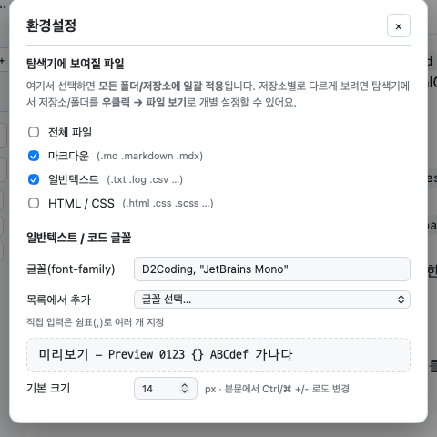

# 환경설정 (Preferences)

툴바의 **⚙️** 버튼으로 별도 모달을 엽니다.

## 탐색기에 보여질 파일
체크박스로 탐색기에 표시할 파일 종류를 선택합니다.

- **전체 파일** — 모든 파일 표시(선택 시 나머지 비활성)
- **마크다운** — `.md` `.markdown` `.mdx`
- **일반텍스트** — `.txt` `.log` `.csv` 등
- **HTML / CSS** — `.html` `.css` `.scss` 등

> ℹ️ 여기서 선택하면 **모든 폴더/저장소에 일괄 적용**됩니다. 저장소별로 다르게 보려면 탐색기에서
> **우클릭 → 파일 보기**로 개별 설정(override)할 수 있습니다. (폴더는 항상 표시)

## 일반텍스트 / 코드 글꼴
- **글꼴(font-family)** — 직접 입력. **쉼표(,)로 여러 글꼴**을 폴백 스택으로 지정(예: `D2Coding, "JetBrains Mono"`).
- **목록에서 추가** — 셀렉트에서 고르면 현재 스택에 자동 추가(중복 제외, 공백 이름은 따옴표 처리).
  설치된 글꼴을 우선 조회하고, 미지원 환경에선 기본 글꼴 목록을 제공합니다.
- **미리보기** — 현재 글꼴 스택을 즉시 확인.
- **기본 크기(px)** — 일반텍스트 뷰어 기본 글꼴 크기. 본문에서 **`Ctrl/⌘ +/-`** 로도 조절.

## 저장
모든 설정(테마, 패널 너비/표시, 파일 필터, 글꼴, 최근 문서, 이동 기록 펼침 등)은 자동 저장되어
다음 실행 때 복원됩니다.
