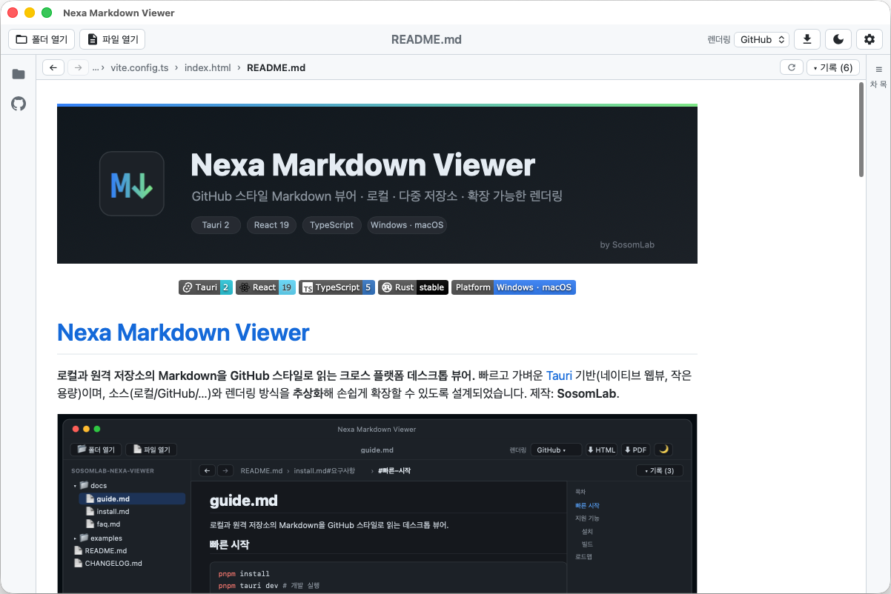
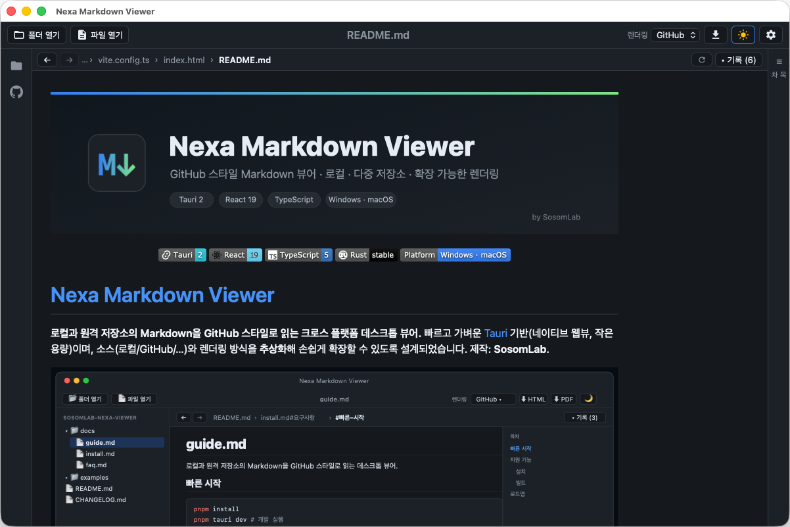
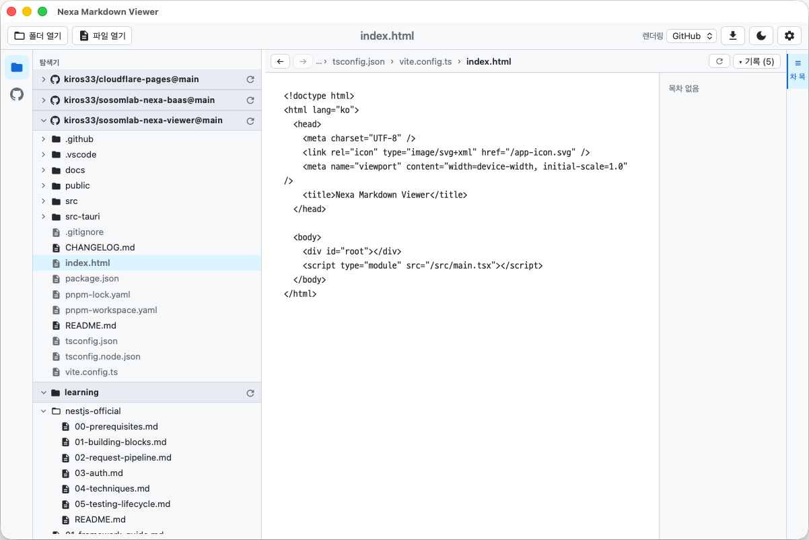
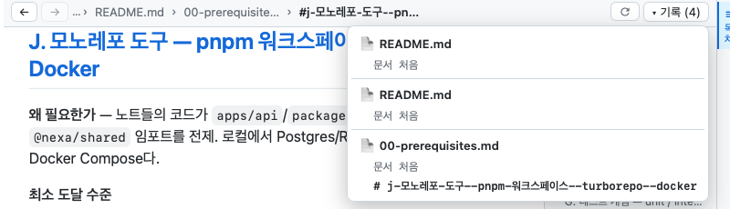

# 문서 보기·이동

## GitHub 스타일 렌더링
선택한 `.md` 문서를 GitHub와 동일한 스타일로 렌더링합니다. GFM(표·체크박스·취소선·자동링크),
**언어별 코드 구문 강조**, 상대 경로 이미지, YAML frontmatter 숨김을 지원합니다.

본문 상단 **경로(브레드크럼)** 는 현재 문서까지의 위치/앵커를 보여줍니다(예: `README.md › install.md#요구사항 › #빠른-시작`).

## 목차(ToC)
우측 패널에 문서의 헤딩이 자동 추출됩니다. 항목을 클릭하면 해당 위치로 이동하며, 이동 기록에도 남습니다.

- 우측 끝의 **목차 바**를 클릭하면 ToC 패널을 **접거나 펼칠 수 있습니다**(본문을 더 넓게).

## 라이트 / 다크 모드
툴바 오른쪽의 🌙/☀️ 버튼으로 전환합니다. 다크 모드에서는 해(라이트 전환) 아이콘이 노란색으로 표시됩니다.

## 일반텍스트 / 코드 파일
`.txt`, `.json`, `.html`, `.css`, 소스코드 등 **비-마크다운 파일**은 고정 글꼴의 일반텍스트 뷰어로 표시됩니다.

- 글꼴/기본 크기는 [환경설정](Preferences)에서 지정합니다.
- 본문에서 **`Ctrl/⌘ +` · `-`** 로 크기 조절, **`Ctrl/⌘ 0`** 으로 기본값 복원.

## 문서 간/내 링크 이동
- **문서 내 앵커**(`#제목`) → 해당 섹션으로 스크롤.
- **다른 문서 링크**(`other.md`, `docs/guide.md#섹션`) → 같은 저장소 내 문서로 이동.
- **외부 링크**(http/https) → 기본 브라우저로 열림.

## 이동 기록(History) & 스크롤 복원
상단 바에서 방문 경로를 **파일#앵커** 단위로 관리합니다.

- **← / →** 뒤로/앞으로
- **▾ 기록** 드롭다운: 방문한 문서/위치 목록에서 한 번에 점프

- **뒤로/앞으로 시 이전에 보던 스크롤 위치를 그대로 복원**합니다.

## 렌더 프로파일
툴바 **렌더링** 드롭다운에서 렌더링 방식을 선택합니다(현재 GitHub). 추후 수식(KaTeX)·다이어그램(Mermaid)
프로파일이 추가될 예정입니다.
